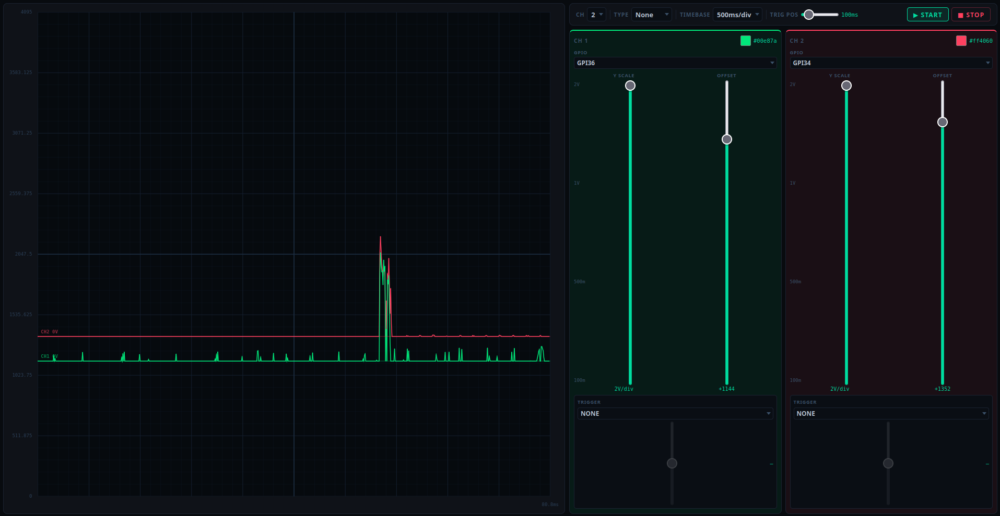

🚀 ESP32 Remote ADC Monitor

This project turns an ESP32 into a high-performance analog signal monitor, accessible via a real-time web interface. Utilizing WebSockets, ADC data is streamed instantly to your browser, allowing for fluid data visualization without page refreshes.
📝 Description

The system reads analog values from the ESP32 ADC pins (dynamically configured via the web UI) and broadcasts them as formatted data frames. The integrated web interface allows users to select which GPIOs to monitor on the fly.

Key Features:

    Backend: High-speed WebSocket server running on ESP32 for ultra-low latency.
    Frontend: Lightweight HTML5/JavaScript interface with optimized string parsing.
    Flexibility: Dynamic pin configuration supporting the GPIO_XX; protocol.

🖥️ Demo

    [!IMPORTANT]
    Live Demo coming soon!

    

🛠️ Quick Start

    Hardware: An ESP32 (DevKit V1, Olimex, or Wemos S2 Mini).

    Software:

        Install dependencies: WebSocketsServer library.
        Upload the code using VS Code + PlatformIO.
        
    Connection: Connect to the IP address displayed in the Serial Monitor (e.g., 192.168.1.50) or on your router interface.

📋 Project Roadmap
✅ Done

    [x] Hotspot or WLAN connexion available
    [x] Initialized WebSocket server on Port 81.
    [x] ADC pin reading implementation 
    [x] Dynamic GPIOXX; string splitting and pin mapping system.
    [x] Formatted data broadcasting: ADC;value;0;0;0.

⏳ To-Do

    [ ] Sending mix measurements
    [ ] X scaling should work
    [ ] Dynamic timebase should work
    [ ] y scale should be 0 4095 fix for now
    [ ] Y channel offset should display the origin and a y correponding legend
    [ ] Y Trigger should work
    [ ] coockie configuration

🔧 Tech Stack

    C++ / Arduino: Embedded logic and hardware control.
    JavaScript (ES6): DOM manipulation and WebSocket management.
    HTML5 / CSS3: Responsive user interface.

Built with ☕ and extensive debugging in VS Code.

